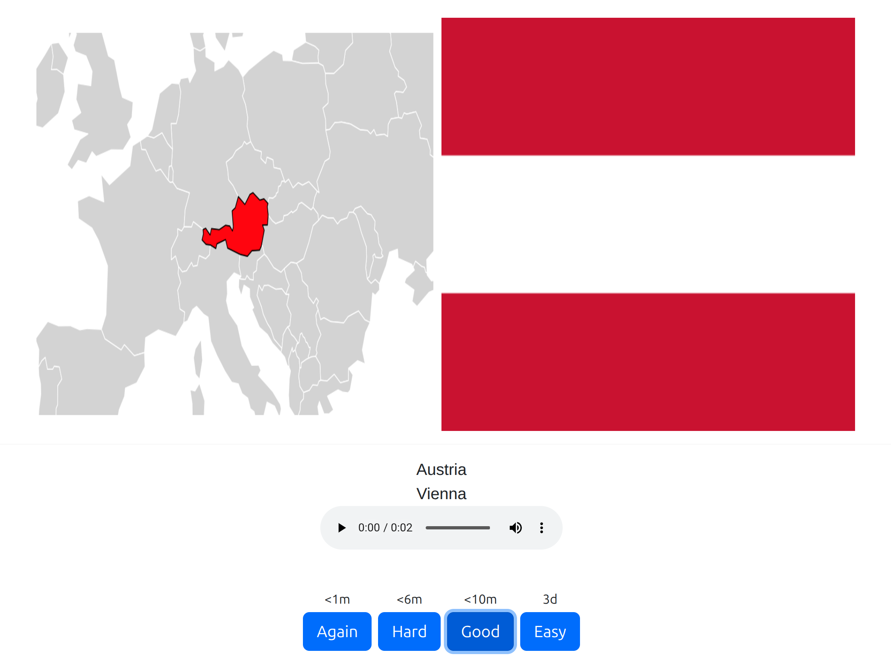

# Anki Flashcards for European countries and their main capitals

# Example



# Language specific versions

<ul>
    <li><a href="https://github.com/marcelmaatkamp/anki-deck-european-countries-and-their-main-capitails/raw/refs/heads/master/decks/en/europese_hoofdsteden_en.apkg">English version</a></li>
    <li><a href="https://github.com/marcelmaatkamp/anki-deck-european-countries-and-their-main-capitails/raw/refs/heads/master/decks/de/europese_hoofdsteden_de.apkg">German version</a></li>
    <li><a href="https://github.com/marcelmaatkamp/anki-deck-european-countries-and-their-main-capitails/raw/refs/heads/master/decks/fr/europese_hoofdsteden_fr.apkg">French version</a></li>
    <li><a href="https://github.com/marcelmaatkamp/anki-deck-european-countries-and-their-main-capitails/raw/refs/heads/master/decks/nl/europese_hoofdsteden_nl.apkg">Dutch version</a></li>
    <li><a href="https://github.com/marcelmaatkamp/anki-deck-european-countries-and-their-main-capitails/raw/refs/heads/master/decks/es/europese_hoofdsteden_es.apkg">Spanish version</a></li>
</ul>

# build

Normally not necessarily, only when you have to make adjustments to the code run these steps.

## step 1

install python dependencies

```bash
pip install geopandas matplotlib pandas genanki gTTS requests pycountry deep-translator Pillow
```

## step 2 

install country vector data

```bash
wget https://www.naturalearthdata.com/http//www.naturalearthdata.com/download/110m/cultural/ne_110m_admin_0_countries.zip
unzip ne_110m_admin_0_countries.zip -d data/
```

## step 3 

generate anki flashcards

```bash
python generate_decks_and_media.py
```
